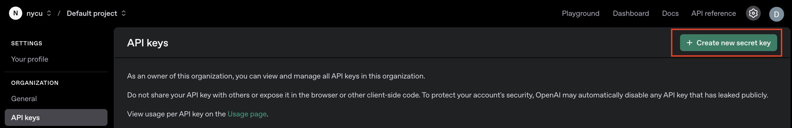

# How to run n8n
- Install docker
- `docker-compose up`
- Open n8n with `http://localhost:5678/`

# How to setup crenditals
## Google
url: https://console.cloud.google.com/


## OpenAI
url: https://platform.openai.com/docs/api-reference/introduction




## Supabase
url: https://supabase.com/docs/guides/api

### Setup Supabase DB
```sql
-- Enable the pgvector extension to work with embedding vectors
create extension vector;

-- Create a table to store your documents
create table documents (
  id bigserial primary key,
  content text, -- corresponds to Document.pageContent
  metadata jsonb, -- corresponds to Document.metadata
  embedding vector(1536) -- 1536 works for OpenAI embeddings, change if needed
);

-- Create a function to search for documents
create function match_documents (
  query_embedding vector(1536),
  match_count int default null,
  filter jsonb DEFAULT '{}'
) returns table (
  id bigint,
  content text,
  metadata jsonb,
  similarity float
)
language plpgsql
as $$
#variable_conflict use_column
begin
  return query
  select
    id,
    content,
    metadata,
    1 - (documents.embedding <=> query_embedding) as similarity
  from documents
  where metadata @> filter
  order by documents.embedding <=> query_embedding
  limit match_count;
end;
$$;
```

# Project1 - 宣傳文案與故事輸出
## Preprocess
1. Upload all your documents and references to Google's drive.
2. Setup the folder of the Google drive trigger inside the workflow.
3. Click the `fileCreated` or `fileUpdated` trigger button.

## Process
1. Create New Workflow
2. Click `...` and choose `Import from file`
3. Choose `Project1.json`
4. Create a specific folder and upload related file or reference on your google drive
5. Chat with bot

# Project2 - 文件去機密化
1. Create New Workflow
2. Click `...` and choose `Import from file`
3. Choose `Project2.json`
4. Place your file which you want to be processed inside the mounted directory
5. Click the trigger button

## Prompt (reviewing)
```
Upload a document. Replace all confidential or personal information with randomized placeholders while keeping the structure intact. Ensure that names, addresses, phone numbers, emails, and any other sensitive data are anonymized while keeping the document's structure intact. The result should be a template that maintains the original formatting and context without exposing any real information. Output only the modified document without extra commentary.
```


